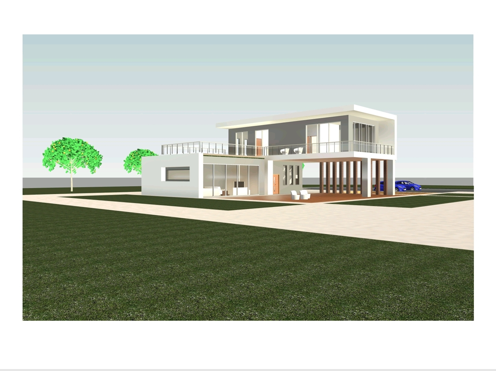

# hemanthg.github.io
Civil Engineering portfolio featuring academic projects, green infrastructure ideas, presentations, and learning resources.
## About Me
- 🎓 Civil Engineering Student
- 🔰 Learning Skills
- 📚 Preparing for GATE Exam
- 🏗 Interested in Structural Engineering and Designing & Planning
  
## Projects

### Modern Residential Building Design

## My Project
)
This project explains the basic steps involved in construction execution such as site preparation, foundation work, structural construction, and finishing activities. It demonstrates

---

## Skills
- AutoCAD
- - Revit (BIM)
- Staadpro (Basic)
- Structural Basics
- Civil Engineering Design
- Project Presentation
  
## Projects
-High Rise Gated Community Project.

-soft clay with electrokinetic consolidation process
